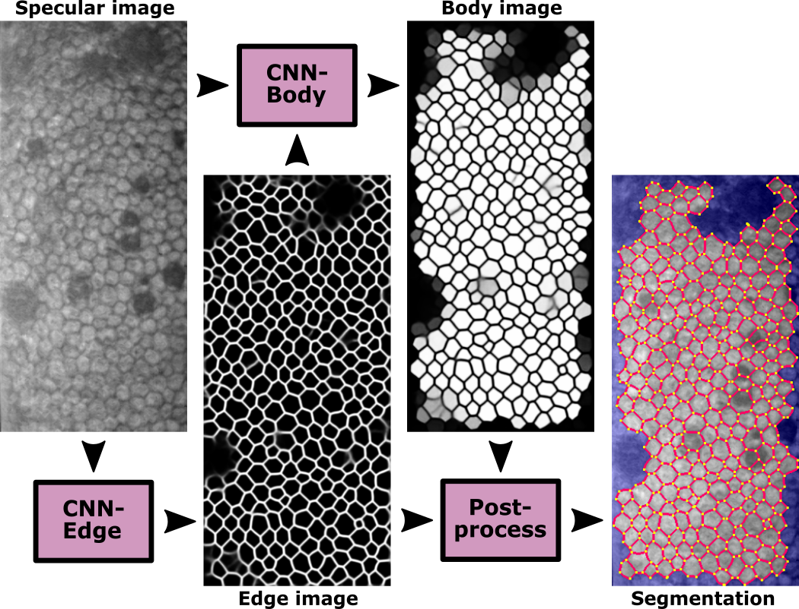
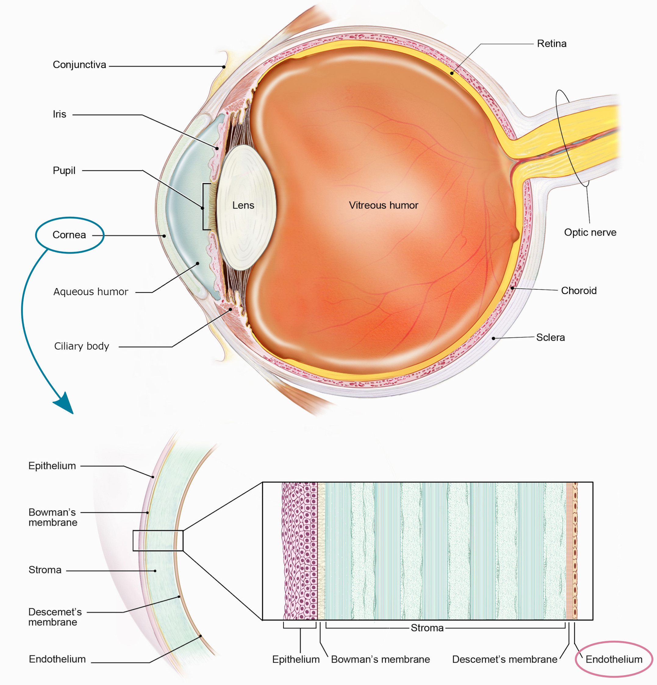
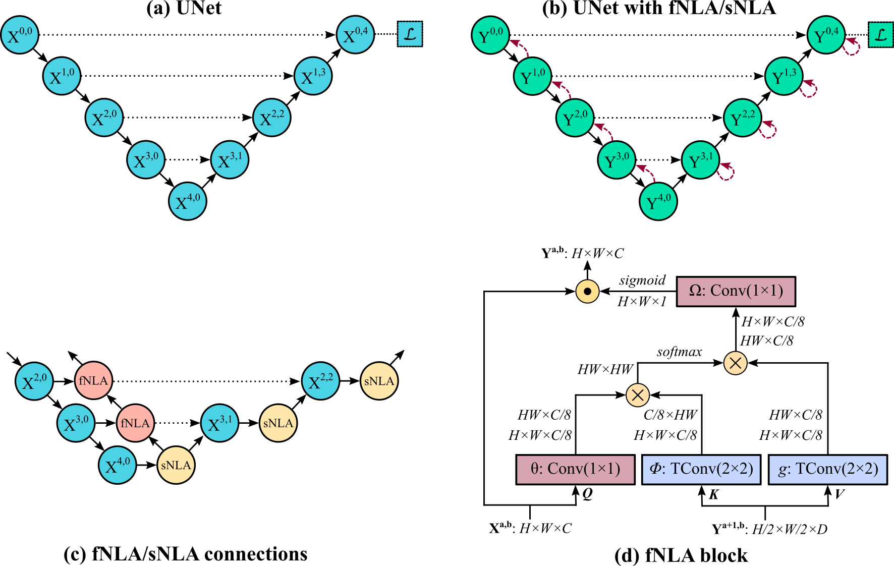
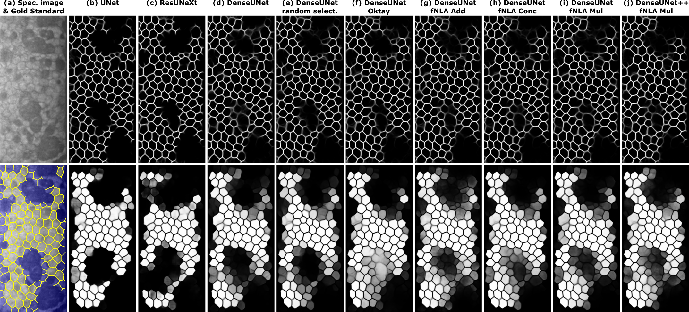
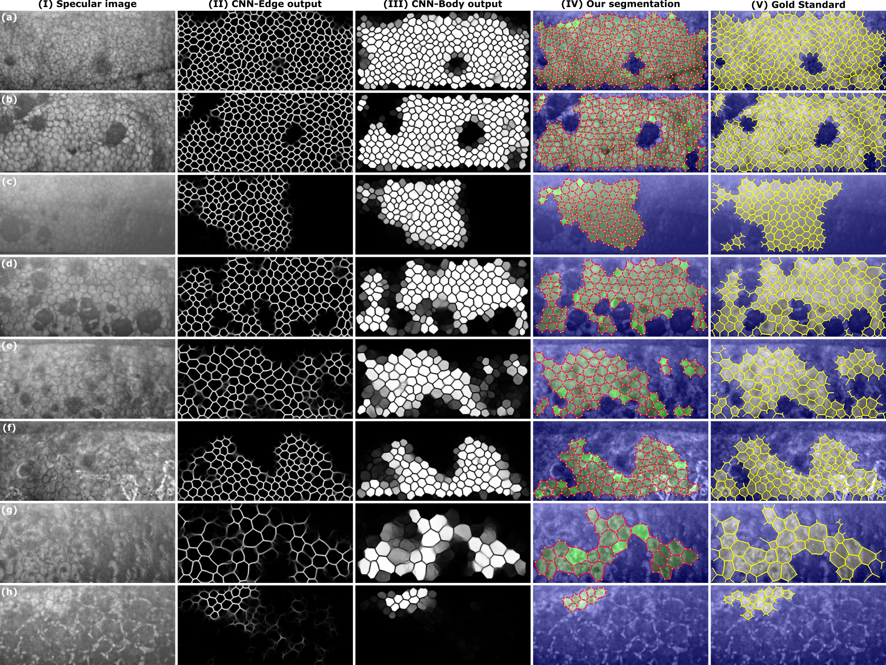

# DenseUNets with feedback non-local attention for the segmentation of specular microscopy images of the corneal endothelium with Fuchs dystrophy
#### by Juan P. Vigueras-Guillén et al. (https://www.researchgate.net/profile/Juan-Vigueras-Guillen) 

### This repo is the official implementation of "feedback non-local attention" (fNLA)

The original paper for fNLA can be found at https://arxiv.org/abs/2203.01882

&nbsp;

## Abstract
To estimate the corneal endothelial parameters from specular microscopy images depicting cornea guttata (Fuchs endothelial dystrophy), we propose a new deep learning methodology that includes a novel attention mechanism named feedback non-local attention (fNLA). Our approach first infers the cell edges, then selects the cells that are well detected, and finally applies a postprocessing method to correct mistakes and provide the binary segmentation from which the corneal parameters are estimated (cell density [ECD], coefficient of variation [CV], and hexagonality [HEX]). In this study, we analyzed 1203 images acquired with a Topcon SP-1P microscope, 500 of which contained guttae. Manual segmentation was performed in all images. We compared the results of different networks (UNet, ResUNeXt, DenseUNets, UNet++) and found that DenseUNets with fNLA provided the best performance, with a mean absolute error of 23.16 [cells/mm<sup>2</sup>] in ECD, 1.28 [%] in CV, and 3.13 [%] in HEX, which was 3–6 times smaller than the error obtained by Topcon’s built-in software. Our approach handled the cells affected by guttae remarkably well, detecting cell edges occluded by small guttae while discarding areas covered by large guttae. fNLA made use of the local information, providing sharper edges in guttae areas and better results in the selection of well-detected cells. Overall, the proposed method obtained reliable and accurate estimations in extremely challenging specular images with guttae, being the first method in the literature to solve this problem adequately.

&nbsp;

<p align="center">

</p>
<p align="center">
<b>Fig. 1 </b> - Flowchard of the approach.
</p>

&nbsp;


## Getting Started Guide

### Files

This repository is a simplified version of the project, only containing the code related to the design of the CNNs (Edge and Body); the postprocessing is in Matlab (work in progress to convert it to Python). 

* **Models**: The tensorflow code for the networks CNN-Edge and CNN-Body, for the different types of networks tested in the manuscript (with and without fNLA). Each python file contains a single network.
* **Weights**: The weights of the networks (H5 file) for the DenseUnets. 
* **Tools**: The functions to create the targets of the two types of networks (CNN-Edge and CNN-Body), and the data augmentation functions.


### Citation

If you use significant portions of our code or ideas from our paper in your research, please cite our work:
```
@article{vigueras2022fnla,
  title={DenseUNets with feedback non-local attention for the segmentation of specular microscopy images of the corneal endothelium with Fuchs dystrophy},
  author={Vigueras-Guillén, Juan P. and van Rooij, Jeroen and van Dooren, Bart T.H. and Lemij, Hans G. and Islamaj, Esma and van Vliet, Lucas J. and Vermeer, Koenraad A.},
  journal={arXiv preprint arXiv:2203.01882},
  year={2022}
}
```


### Questions or Comments

Please direct any questions or comments to me; I am happy to help in any way I can. You can email me directly at J.P.ViguerasGuillen@gmail.com

&nbsp;


## Introduction to the corneal endothelium
The corneal endothelium is a single layer of squamous cells in the posterior cornea (Fig. 1) with barely any extracellular matrix (they form a well-packed tessellation of cells). The endothelium controls the state of dehydration of the whole cornea, allowing fluids and nutrients from the aqueous humor to enter the cornea to nourish the corneal cells (passive action) while pushing out the excess of fluids to keep a constant state of corneal dehydration (active action, necessary to keep a transparent cornea). The endothelium lacks cell regeneration, and the amount of endothelial cells naturally decrease as we age, although this is not clinically problematic. However, trauma, surgery, or certain diseases accelerate the death of endothelial cells, which might reach a point where not enough cells are available to expel the excess of fluids, thus leading to edema and, eventually, the necessity for corneal transplantation.

<p align="center">
  
</p>
<p align="center">
<b>Fig. 1</b> - (Top) Cross-sectional view of the human eye. (Bottom) Layers of the cornea. (Courtesy of: NIH, National Eye Institute, https://www.flickr.com/photos/nationaleyeinstitute).
</p>

&nbsp;

The endothelium can be imaged in vivo and in a non-invasive manner with specular microscopy, although the quality of the images is rather poor. Nevertheless, the automatic segmentation of the endothelial cells is a useful method to estimate of the corneal parameters.

In this work, we deal with endotheliums with presence of guttae, which is a common event in people with Fuchs Endothelial Dystrophy (FED). Guttae are an abnormal growth of the Descemet's membrane, which pushes the endothelial cells out of the endothelial plane (thus not visible with the specular imaging, appearing as black droplets) and stresses the endothelial cells, which ultimately die. Therefore, it is clinically relevant to perform a correct segmentation in such complicated images.

&nbsp;

## Brief description of the method
CNN-Edge infers the cell edges, which is the core of the method. However, we need to keep only the cells that are correctly detected. This entails to discard:
1. cells whose edges were not correctly detected.
2. partial cells in the border of the image,
3. areas affected by blurriness, and
4. cells affected by guttae.

For the guttae, we aim to infer the hidden edges if the guttae is small, therefore recovering the cells that were occluded; but if the guttae is too large and thereby impossible to determine the cells hidden underneath, we aim to discard those untrustworthy areas. Overall, we do not want to have partial cells identified as whole cells. For this, we define CNN-Body, which infers the region of interest where cell bodies are correctly detected. 

Finally, the postprocessing simply applies watershed to the edge images to fix any edge-discontinuity, then it uses the body images to determine whether to keep a cell (superpixel) or not, and finally it computes the corneal parameters only from those trustworthy cells.

&nbsp;
&nbsp;

## The attention mechanism: Feedback non-local attention
Feedback non-local attention (fNLA) is an attention mechanism for segmentation in CNNs, based on the 'non-local attention (NLA)' methodology by Wang et al (https://arxiv.org/abs/1711.07971). Similar to NLA, fNLA computes the response at a position as a weighted sum of the features at all positions, but fNLA uses (as 'key' and 'value' elements) the tensor of a lower resolution stage, propagating the attention information within the encoder from the lowest resolution stage back to the first resolution stage. If the attention mechanism is placed in the decoder, a self non-local attention (sNLA) is used instead. We tested different types of aggregation: multiplicative (default one), additive, and concatenative.

&nbsp;

<p align="center">
  
</p>
<p align="left">
<b>Fig. 2</b> - A schematic representation of the <b>(a)</b> UNet backbone, <b>(b)</b> a simplified representation of adding fNLA/sNLA blocks to the UNet, where a red arrow indicates self-attention (sNLA) if it returns to the same node or feedback attention (fNLA) otherwise, <b>(c)</b> a schematic overview of how the fNLA/sNLA blocks are added to the UNet backbone for the three deepest resolution scales, and <b>(d)</b> a detailed description of an fNLA block with multiplicative aggregation. In the case of sNLA, φ and g are also a 1×1 convolution with X<sup>a,b</sup> as input.
</p>

&nbsp;
&nbsp;


## Quantitative Results

The quantitative results on our dataset (1203 images, 500 of which have guttae) showed that: 
1. DenseUNets are a better choice than UNets and ResUNeXts for this problem. 
2. There is a subtle improvement in the performance when using fNLAs: 
   * Smaller MHD (modified Hausdorff distance) in the edge images. MHD is probably the best metric to compare how close the edge segmentation is with respect to the manual annotation).
   * Higher accuracy and DICE in the body images. In the body images, DICE is probably the best metric to compare the overlap of selected cells.
   * Overall smaller Mean Absolute Error (MAE) for all the corneal parameters.

&nbsp;
&nbsp;

**Performance in the CNNs:**

| Method               | Params.    | Edge Acc.  | Edge DICE   | Edge MHD   | Body Acc.   | Body DICE   | Body MHD   |
|:-------------------- |:----------:|:----------:|:-----------:|:----------:|:-----------:|:-----------:|:----------:|
| UNet                 | 21.59 M    | 96.37      | 86.16       | 0.129      | 94.25       | 92.02       | 0.563      | 
| ResUNeXt             |  6.87 M    | 96.31      | 86.03       | 0.144      | 93.98       | 91.65       | 0.582      | 
| DenseUNet            |  0.38 M    | 96.41      | 86.30       | 0.139      | 94.48       | 92.04       | 0.688      | 
| DenseUNet++          |  0.35 M    | 96.42      | 86.30       | 0.137      | 94.54       | 92.09       | 0.656      | 
| DenseUNet Oktay      |  0.38 M    | 96.40      | 86.27       | 0.140      | 94.49       | 92.10       | 0.691      | 
| DenseUNet fNLA-Mul   |  0.43 M    | 96.40      | 86.29       | 0.125      | 94.69       | 92.36       | 0.578      | 
| DenseUNet fNLA-Conc  |  0.45 M    | 96.41      | 86.30       | 0.124      | 94.67       | 92.45       | 0.555      | 
| DenseUNet fNLA-Add   |  0.45 M    | 96.36      | 86.21       | 0.125      | 94.66       | 92.36       | 0.592      | 

&nbsp;
&nbsp;

**Performance in the estimation of the corneal parameters:**

| Method               | ECD MAE   | CV MAE   | HEX MAE  |
|:-------------------- |:---------:|:--------:|:--------:|
| UNet                 | 25.79     | 1.52     | 3.89     |
| ResUNeXt             | 25.84     | 1.69     | 3.79     |
| DenseUNet            | 23.81     | 1.30     | 3.36     |
| DenseUNet++          | 24.77     | 1.43     | 3.43     |
| DenseUNet Oktay      | 23.50     | 1.37     | 3.26     |
| DenseUNet fNLA-Mul   | **23.16** | **1.28** | 3.13     |
| DenseUNet fNLA-Conc  | 24.05     | 1.37     | **3.12** |
| DenseUNet fNLA-Add   |  24.72     | 1.32     | 3.15     |

&nbsp;
&nbsp;

## Qualitative Results

The improvement of fNLAs were more evident in the qualitative results. Indeed, fNLA provides better inference of edges in areas of guttae, reaching beyond what the manual annotators selected, and they also provide more probabilistic results for the detection of well-detected cells in the body images. Regarding the type of aggregation in fNLAs, both multiplicative and concatenative types are remarkable, but the additive type (which is the most common type of attention aggregation in other types of attention mechanisms) is clearly underperforming.

&nbsp;
<p align="center">

</p>
<p align="left">
<b>Fig. 3</b>. <b>(a)</b> Illustrative specular image with guttae and its manual annotation (edges in yellow; non-ROI area in blue). For the different networks (indicated on top), the inference of this image for the CNN-Edge <b>(top image)</b> and CNN-Body <b>(bottom image)</b>. Topcon's software did not detect a single cell in this image.
</p>

&nbsp;
&nbsp;


## Results

Images with guttae were graded to illustrate how the network performs for different degrees of complexity: low (grade 1-2), medium (grade 3-4), and high complexity (grade 5-6).

&nbsp;
<p align="center">

</p>
<p align="left">
<b>Fig. 4</b>. Eight illustrative images with guttae, two cases per grade: <b>(a, b)</b> grade 3, <b>(c, d)</b> grade 4, <b>(e, f)</b> grade 5, <b>(g, h)</b> grade 6. From left to right: <b>(I)</b> the specular image, the output of the <b>(II)</b> CNN-Edge and <b>(III)</b> CNN-Body for the DenseUNet fNLA-Mul, <b>(IV)</b> the final segmentation (edges in red; vertices in yellow; non-ROI in blue; and the detected cells in two tonalities of green: brighter green for the cells whose body-intensity was between 0.50–0.75, and darker green for the cells whose body-intensity was between 0.75–1.00), and <b>(V)</b> the gold standard (the annotated edges in yellow; non-ROI in blue). The number of detected cells were (in order, [a to h]): [262, 219, 107, 120, 75, 86, 29, 13] for the manual annotations, [258, 213, 92, 113, 70, 82, 25, 8] for our method , and [45, 34, 0, 38, 6, 0, 0, 0] for Topcon’s software.
</p>


&nbsp;
